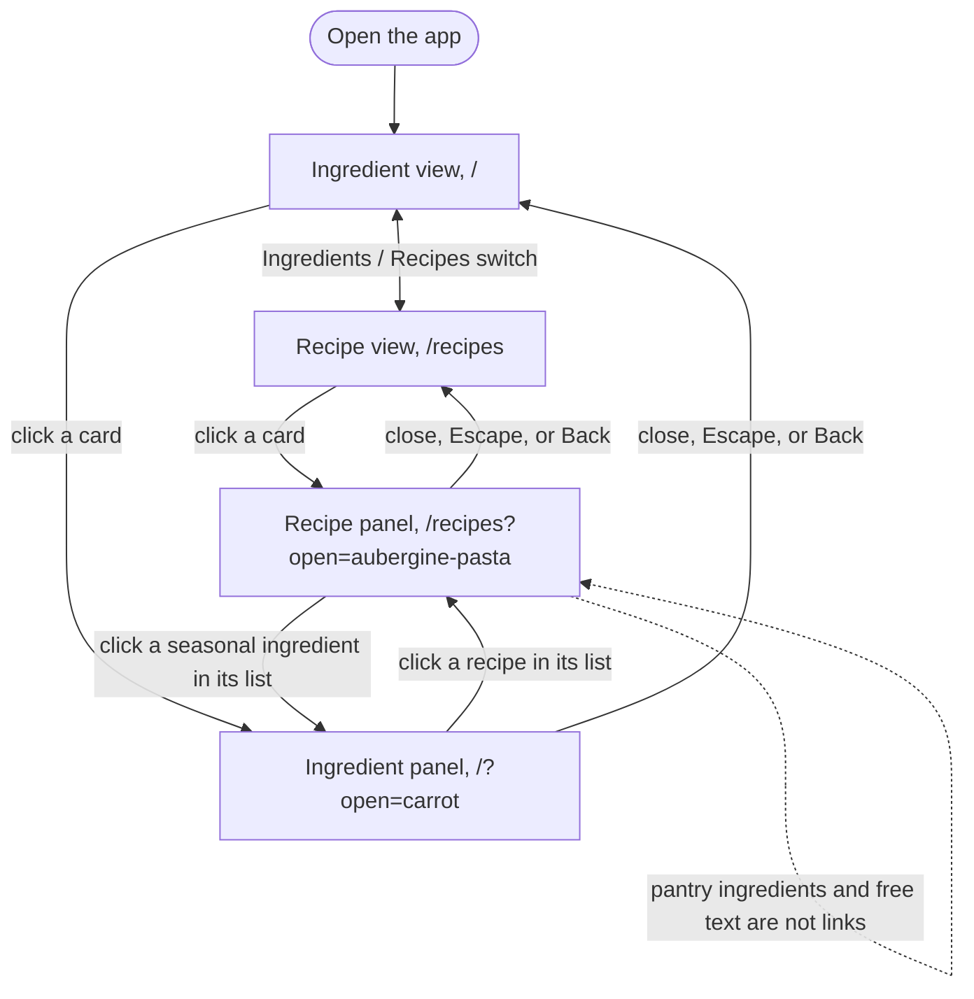
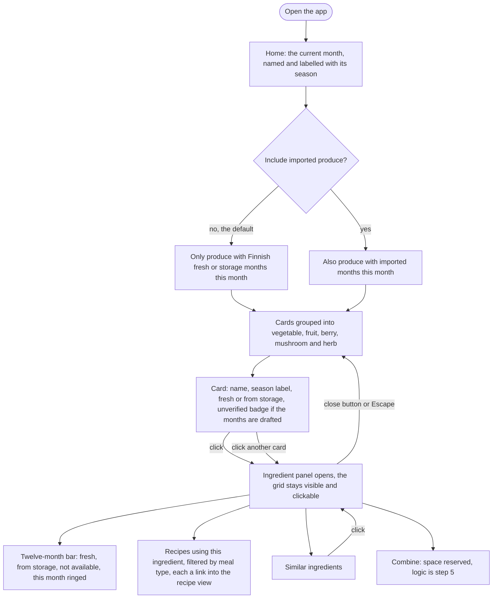
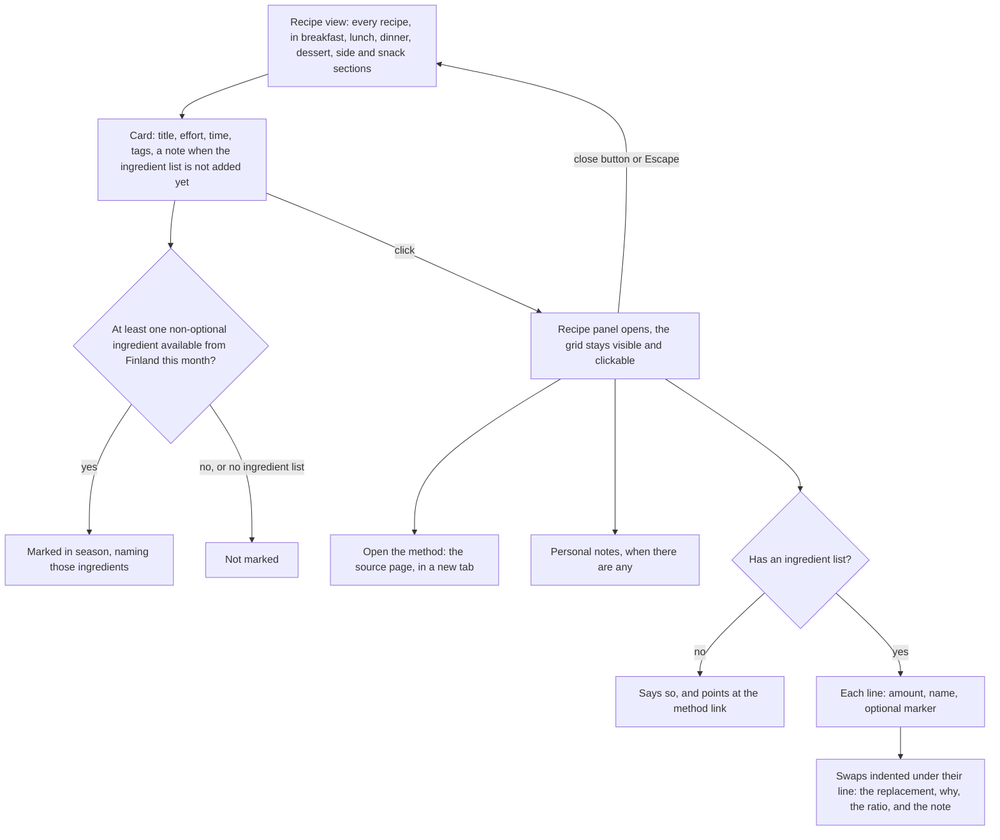
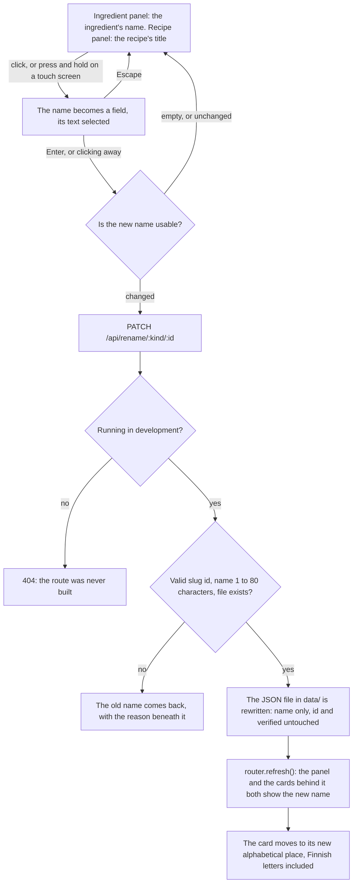
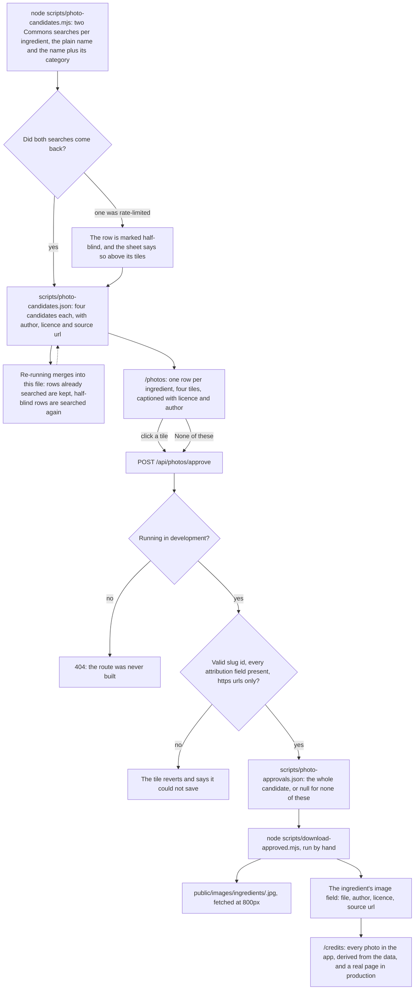

# User flows

Mermaid flowcharts of what the app actually does, updated in the same change
that alters a flow, so a flow can be reviewed by reading rather than by clicking
through the app. Anything not drawn here is not built yet.

## Choosing a view

Built in step 2. The front page has two views, each its own address, and the
side panel's contents are in the address too, as `?open=<id>`. So a reload
keeps the panel open, Back undoes the last thing opened, and the links between
the views land with the right panel showing.

## Browsing the current month, and opening an ingredient

Built in issues 007 and 008. Recipes in the panel became links in step 2.

## Browsing recipes, and opening one

Built in step 2.

## Renaming an ingredient or a recipe

Built in issue 009. Since step 2 a recipe title is renamed in the recipe panel;
in the ingredient panel it is a link instead. Development only: in a production build the write route is
not compiled at all, and every name renders as plain text with nothing to click.

Lists are ordered by the name on screen, not by the id underneath, so renaming
something moves it. Tia's call on 2026-09-17: ids stay English slugs forever, so
id order stops being alphabetical the moment a name becomes Finnish.

## Approving a photo for an ingredient

Built in issue 010. Development only, apart from the credits page: the contact
sheet and its write route are not compiled into a production build at all, so
`/photos` is a 404 there. Nothing enters `public/` or `data/` by clicking around
the sheet; downloading is a separate, deliberate step run from the terminal.

## Not drawn yet

The recipe panel (step 2), the month strip and the month view (step 3),
favourites, tried and monthly progress (step 4), and combine (step 5).
